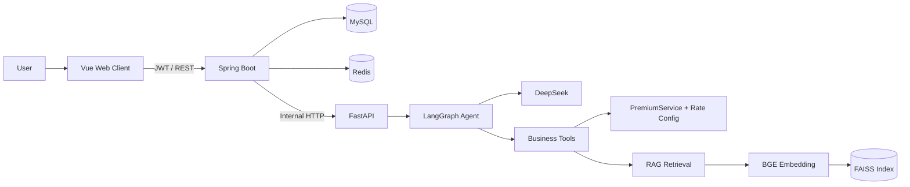

# Insurance AI Platform

AI 保险咨询与知识服务平台  
Vue 3 + Spring Boot + FastAPI + LangGraph + RAG

## Product Case Study｜产品作品集

📄 [View Product Case Study / 查看作品集](./docs/Insurance-AI-Product-Case-Study.pdf)

Covers:
- Product Overview / 产品背景
- User Flow / 用户流程
- System Architecture / 系统架构
- State Design / 状态设计
- Cross-service Interaction / 跨服务交互
- Product Screenshots / 产品页面


核心能力包括 JWT 认证、同步多轮对话、保费估算工具、PDF 知识库、可追踪 RAG 来源、Redis 限流与幂等、故障语义、可观测性以及浏览器端端到端验收。当前回归基线为 **Java 92、Python 84、Vue 27** 项自动化测试。

## Architecture Overview

平台遵循清晰的三层运行边界：

- **Vue Web Client** 只访问 Java `/api/**`，不直连 Python、MySQL 或 Redis。
- **Spring Boot** 是平台业务数据与安全入口，调用链保持 `Controller → Service → Client / Mapper`。
- **FastAPI AI Service** 管理 LangGraph、Tool Calling、Embedding、FAISS 和 DeepSeek，不访问 Java 业务数据库。
- **MySQL** 保存用户、会话、消息、聊天请求与文档元数据，是持久化事实源。
- **Redis** 只承担缓存、限流和幂等加速；关键业务事实仍由 MySQL 保存。
- **FAISS** 索引及其检索元数据由 Python 侧管理，不进入 Java 数据访问层。

当前聊天链路是同步 HTTP 调用。MQ、Worker 和异步 `task_id` 仅属于未来演进方向，并未作为现有能力实现。

## Key Features

- **账户与会话**：注册、登录、JWT 鉴权、会话列表及历史消息。
- **Agent 对话**：LangGraph 状态编排、DeepSeek 模型调用、工具路由与多轮上下文。
- **保费计算**：模型通过受控工具调用 Python `PremiumService`，依据本地费率 JSON 配置完成估算。
- **知识库管理**：PDF 上传、SHA-256 校验、文档状态管理与受控索引发布。
- **RAG 来源追踪**：回答可返回 `documentName`、`page`、`snippet`、`score`，前端展示实际检索来源。
- **双检索实现**：默认 LangChain 检索链，并保留 LlamaIndex 实现用于受控选择与对照。
- **可靠性控制**：请求幂等、固定窗口限流、超时预算、独立熔断器和明确的 `UNKNOWN` 结果。
- **可观测性**：Trace ID 贯穿边界，结构化日志以及 Actuator liveness/readiness 健康探针。

## Tech Stack

| Layer | Technologies |
| --- | --- |
| Web | Vue 3, TypeScript, Vite, Vue Router, Vitest |
| Java | Java 17, Spring Boot, Spring Security, MyBatis-Plus, Flyway, Resilience4j, Actuator |
| Python | Python 3, FastAPI, LangGraph, LangChain, LlamaIndex, Pydantic |
| AI / RAG | DeepSeek, BGE `bge-base-zh-v1.5`, FAISS, PDF parsing |
| Data | MySQL, Redis |
| Validation | JUnit, Testcontainers, pytest, Vitest, Chrome E2E |

## Core Call Flow

### Chat and tool calling

```text
Vue ChatView
  → POST /api/v1/chat/messages
  → JWT filter → ChatController → ChatService
  → AgentClient → POST /internal/v1/agent/chat
  → FastAPI → LangGraph → DeepSeek
  → optional tool call
      ├─ premium calculation → Python PremiumService → local rate JSON
      └─ insurance knowledge → BGE + FAISS
  → ChatService persists user/assistant messages
  → Vue renders answer and optional sources
```

简单问候等直接回答路径可以不调用工具。需要工具能力时，模型只能通过已注册工具进入相应边界；Python 不读取 Java 业务数据库。

### Knowledge ingestion and retrieval

```text
PDF upload
  → DocumentController → DocumentService
  → file validation + SHA-256 + metadata transaction
  → KnowledgeClient → Python staging index build
  → atomic index publish
  → document status INDEXED

Knowledge query
  → LangGraph knowledge tool
  → retriever → BGE embedding → FAISS search
  → answer + structured sources
  → Java response → Vue source cards
```

索引构建采用 staging 与原子发布语义，避免未完成索引被在线查询看到。磁盘上的 FAISS pickle/index 文件只应来自可信构建流程。

## Reliability and Failure Semantics

- 外部 `Idempotency-Key` 与内部 `requestId` 分工明确，避免浏览器重试造成重复副作用。
- Redis 缓存幂等摘要以加速查询；MySQL 唯一约束、请求状态和持久化结果提供最终防重与回放依据。
- 聊天仅在连接失败、可判定请求未送达时最多重试一次；读取超时进入 `UNKNOWN`，Knowledge 写调用不自动重试。
- Agent 与 Knowledge 两条内部调用使用独立超时预算和熔断器，避免一个依赖拖垮另一条链路。
- 限流采用 Redis Lua 原子固定窗口计数；Redis 不可用时 fail-closed，返回限流服务不可用。
- Trace ID、结构化日志和稳定错误码用于关联 Vue、Java、Python 三层故障。

更完整的失败语义见 [架构文档](docs/ARCHITECTURE.md) 与 [API 契约](docs/API.md)。

## RAG and AI

- 在线生成模型：**DeepSeek**，密钥仅通过 `DEEPSEEK_API_KEY` 环境变量注入。
- Embedding：**BGE `bge-base-zh-v1.5`**，向量维度 768。
- Vector Store：**FAISS**，索引与结构化文档元数据由 Python 侧持有。
- 检索链：LangChain 为默认实现，LlamaIndex 为可选实现；通过配置选择，不改变 Java API。
- 来源契约：工具输出同时保留模型可读文本与结构化检索结果，最终响应冻结实际使用的 sources。
- LoRA 仍是离线实验资产，**没有接入当前在线推理链路**，因此不宣称其为平台生产能力。

## Validation Evidence

最近一次完整 Resume Evidence Validation 的本地结果：

| Scope | Result |
| --- | --- |
| Java regression | 92 passed |
| Python regression | 84 passed |
| Vue regression | 27 passed |
| Online public API requests | 34 / 34 succeeded |
| Actual RAG source assertions | 19 / 19 passed |
| Expected RAG scenarios | 17 / 18 observed |
| Strict route sequence | 25 / 34 matched |

`17 / 18` 表示其中一个多轮场景的第二轮由模型直接回答，未发生实际检索，因此不伪造 sources。`25 / 34` 是对预期工具调用序列的严格匹配结果，不等同于模型准确率或业务成功率。

验收覆盖真实 MySQL、Redis、DeepSeek、BGE、FAISS、Java/Python 联调和 Chrome 浏览器流程。以上数字是特定本地环境、固定样本与单次验收窗口中的工程证据，**不是生产 SLA、容量承诺或通用模型评测结论**。详细边界与证据见 [Resume Evidence](docs/RESUME_EVIDENCE.md)。

## Quick Start

### Prerequisites

- Java 17 and Maven
- Python 3.10+（最近验收使用 3.12.6）
- Node.js 20.19+ or 22.12+
- MySQL 8+
- Redis 6+
- A valid DeepSeek API key

先创建一个空的 MySQL 数据库；Java 启动时由 Flyway 创建和升级表结构。启动本机 MySQL 与 Redis 后，分别运行三个应用。

### 1. Start the Python AI service

```bash
python -m pip install -r requirements-dev.txt
export DEEPSEEK_API_KEY='<your-key>'
python -m uvicorn api.main:app --host 127.0.0.1 --port 8000
```

Windows PowerShell 使用 `$env:DEEPSEEK_API_KEY='<your-key>'` 设置当前进程环境变量。不要把真实密钥写入仓库。仅在选择 LlamaIndex 检索实现时安装 `requirements-llamaindex.txt` 中的额外依赖。

### 2. Start the Java backend

至少配置以下环境变量：

```bash
export MYSQL_URL='jdbc:mysql://127.0.0.1:3306/insurance_ai'
export MYSQL_USERNAME='<mysql-user>'
export MYSQL_PASSWORD='<mysql-password>'
export JWT_SECRET_BASE64='<base64-encoded-random-value-of-at-least-32-bytes>'
export PYTHON_AI_BASE_URL='http://127.0.0.1:8000'
cd java-backend
mvn spring-boot:run
```

Redis 默认地址为 `127.0.0.1:6379`；可通过 `REDIS_HOST`、`REDIS_PORT` 和 `REDIS_PASSWORD` 覆盖。PowerShell 环境变量使用 `$env:NAME='value'` 语法。

### 3. Start the Vue client

```bash
cd web-client
npm ci
npm run dev
```

访问 Vite 输出的本地地址。开发代理会把 `/api` 转发到 `http://127.0.0.1:8080`。可选的 Python 演示界面可通过 `streamlit run app.py` 启动，但正式 Web Client 是 Vue 应用。

本仓库没有声明 Docker Compose 一键启动；生产环境还需要单独完成密钥管理、TLS、持久卷、备份和部署配置。

## Project Structure

```text
api/                    FastAPI 路由、生命周期与内部接口
application/            Python 应用门面与响应组装
graph/                  LangGraph 状态图和节点编排
tools/                  保费估算与知识检索工具
services/               模型、保费计算与知识检索服务
rag/                    Embedding、FAISS 与检索实现
java-backend/           Spring Boot 业务后端
web-client/             Vue 3 正式 Web Client
tests/                  Python 自动化测试
scripts/                验收、索引与辅助脚本
docs/                   架构、契约、阶段和验收文档
```

## Current Limitations

- 当前聊天仍是同步请求，不适合超长任务；异步任务与消息队列尚未实现。
- DeepSeek 是当前在线生成模型；LoRA adapter 未接入在线推理。
- 浏览器验收是受控本地小样本证据，不代表生产并发、时延或可用性。
- `UNKNOWN` 状态会被保留且不会自动重发，完整自动对账仍是后续演进项。
- FAISS 本地索引要求可信来源，尚未提供面向不可信索引文件的隔离加载机制。
- 自动化生产部署、灾备演练、容量测试和独立安全渗透测试不在当前交付范围内。

## Evolution and History

项目按正式顺序推进至 Phase 12：Phase 9.5 完成 Vue Minimal Chat Client，Phase 10.5 完成 Document Client Extension，Phase 11 完成可观测性与容错，Phase 12 完成测试、联调与最终审计。此后另行开展了独立 Resume Evidence Validation。

阶段名称用于保留工程决策与学习轨迹；当前功能状态以 [Project Status](docs/PROJECT_STATUS.md)、源码和实际测试结果为准。

## Documentation

- [Project Status](docs/PROJECT_STATUS.md) — 当前完成度、测试基线与限制
- [Architecture](docs/ARCHITECTURE.md) — 冻结架构、边界与调用关系
- [API](docs/API.md) — 外部及内部接口契约
- [Database](docs/DATABASE.md) — MySQL 模型、事务与迁移
- [Redis](docs/REDIS.md) — 缓存、限流和幂等语义
- [Web Client Plan](docs/WEB_CLIENT_PLAN.md) — Vue 客户端范围与验收
- [Resume Evidence](docs/RESUME_EVIDENCE.md) — 简历证据验收报告

## Upstream Attribution

本仓库最初基于 Datawhale 的 [llm-cookbook](https://github.com/datawhalechina/llm-cookbook) 学习仓库开展实验，随后逐步重构并演进为当前 Insurance AI Platform。感谢 Datawhale 社区及原项目贡献者提供的学习材料与开源基础。

