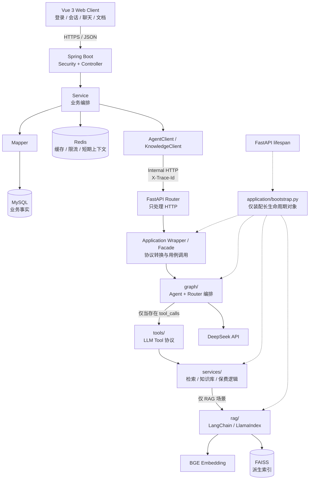

# Insurance AI Platform 架构

> 项目名称：Insurance AI Platform / 保险智能问答平台
> 文档版本：v1.1
> 状态：主体架构已冻结；2026-08-06 经批准增补 Vue Web Client；目标架构已于 Phase 12 完成验收
> 设计基线：`2b700ab5913d0266fa4469af9b1c25ea1a095f1d`
> 当前状态：[PROJECT_STATUS.md](./PROJECT_STATUS.md)
> 范围：冻结架构、服务边界与客户端定位；历史审计段落保留对应阶段时点语义

本文件冻结的是目标系统的服务职责、依赖方向、部署关系、数据所有权和生命周期原则。
精确 API 字段、错误码、MySQL 表、Redis Key/TTL 和容错参数在 Phase 2 文档中冻结，但不得
违反本文件。若后续代码与冻结后的本文件不一致，必须先报告架构漂移；不得自行选择代码或
文档一方覆盖另一方。

修改冻结架构前，必须先说明修改原因、影响范围、收益、成本、替代方案，以及是否导致已有
代码或契约失效，并等待批准。

## 1. 项目目标

### 1.1 定位

Insurance AI Platform 是一个面向保险知识问答、保费估算和知识库管理的双服务平台。
项目目标是形成一个能够支撑 Java 后端（AI 方向）实习/校招面试的真实、可运行、
可解释项目，而不是为了简历堆叠组件。

目标系统采用：

```text
Web Client → Java Backend → Python AI Service
```

### 1.2 职责定位

- Java Backend 是业务系统入口：负责 REST API、用户与权限、会话与消息、文档元数据、
  MySQL、Redis、文件接入、统一响应、参数校验、异常处理、日志和 TraceId。
- Python AI Service 是 AI 能力提供者：负责 LangGraph Agent、Tool Calling、RAG、
  Embedding、FAISS、DeepSeek 和索引构建。
- Java 不重写 Python 已有的 LangGraph/RAG；Python 不接管 Java 的业务数据库职责。
- 第一版聊天为同步 HTTP 调用，以可运行、可测试和容易解释为优先目标。

### 1.3 当前事实与目标态

Phase 1 冻结时，基线只有一个 Streamlit 驱动的 Python 应用。以下目标已在 Phase 3～12
逐步落地，并于 2026-08-13 完成最终验收：

- `web-client/` 是正式 Vue 用户入口，`app.py` 保留为 Python 调试入口；
- `application/bootstrap.py` 装配 Python 对象图，FastAPI lifespan 管理服务生命周期；
- `graph/`、`tools/`、`services/`、`rag/` 已形成真实 AI 调用链；
- Java Backend 已实现 JWT、会话/消息、MySQL、Redis、聊天、文档、TraceId、容错和健康检查；
- Vue Web Client 已实现登录/注册、会话/聊天和文档管理，且只访问 Java 公共 API；
- LoRA Adapter 基于 Qwen2.5-0.5B-Instruct，但未接入在线 DeepSeek Agent。

Phase 12 使用真实 MySQL 8.4、Redis 7.4、Java/Python HTTP 和 Chrome 验证平台链；真实 DeepSeek/BGE
在线调用因未提供测试 Key 保留 WARNING。完成证据见 [PROJECT_STATUS.md](./PROJECT_STATUS.md)。

## 2. 总体架构

### 2.1 ASCII 架构图

```text
┌─────────────────────────────┐
│       Vue 3 Web Client       │
│  登录 / 会话 / 聊天 / 知识库 │
└──────────────┬──────────────┘
               │ HTTPS / JSON
               ▼
┌──────────────────────────────────────────────────────────────┐
│                  Java Backend (Spring Boot)                  │
│                                                              │
│  Security / Controller                                       │
│            │                                                 │
│            ▼                                                 │
│         Service                                              │
│        /   │    \                                             │
│       /    │     \                                            │
│  Mapper   Redis   AgentClient / KnowledgeClient              │
│    │                │                                         │
│    ▼                │ internal HTTP + X-Trace-Id              │
│  MySQL              │                                         │
└─────────────────────┼────────────────────────────────────────┘
                      ▼
┌──────────────────────────────────────────────────────────────┐
│                   Python AI Service                          │
│                                                              │
│  FastAPI Router（只处理 HTTP）                                │
│            │                                                 │
│  Application Wrapper / Facade                                │
│            │                                                 │
│  graph/（Agent + Router） ───────────────→ DeepSeek LLM       │
│            │ [仅当存在 tool_calls]                           │
│            ▼                                                 │
│         tools/ → services/                                   │
│                       │ [仅 RAG 场景]                         │
│                       ▼                                      │
│                  rag/ → BGE Embedding → FAISS                │
│                                                              │
│  bootstrap：仅由 lifespan 调用，负责装配上述长生命周期对象    │
└──────────────────────────────────────────────────────────────┘
```

主调用方向必须保持：

```text
Client → Spring Boot → Python AI Service
```

Web Client 不得直接调用 Python。Python AI Service 不得反向调用 Java Controller 来完成
业务查询，也不得访问 Java 的 MySQL/Redis。

### 2.2 Mermaid 架构图



### 2.3 部署与网络原则

- Java Backend 是唯一对 Web Client 暴露的业务入口。
- Python AI Service 只暴露内部网络 API，不承担用户 JWT 鉴权。
- Java 与 Python 独立进程部署，通过 HTTP 通信，不共享进程内对象。
- 第一版允许单机部署两个进程，但服务边界不能依赖同进程调用。
- 不假定共享数据库；文件传递方式和部署路径在 Phase 2/10 明确。
- Streamlit 可以保留为 Python 本地调试 UI，但不是目标平台正式入口。

### 2.4 正式客户端与调试客户端

目标平台的正式用户链路固定为：

```text
Vue 3 Web Client → Java Spring Boot Backend → Python FastAPI AI Service
```

Vue Web Client 只负责页面、表单、基础校验、JWT 携带、调用 Java 公共 API，以及展示
loading、业务状态和稳定错误。它不得直连 Python，不操作 MySQL、Redis 或 FAISS，不保存
长期聊天事实，也不判断或恢复 `SUCCEEDED / FAILED / UNKNOWN`。`UNKNOWN` 由 Java 业务层
确定；客户端只按公共 DTO 展示，且不得自动重发同一个 AI 请求。

Streamlit 继续保留，定位为 Python Agent 本地调试、旧版功能验证以及 Graph/Tool/RAG
诊断入口。它的链路是 `Streamlit → Python`，不经过 Java JWT、ChatService、MySQL、Redis、
AgentClient 或 Java 文档状态机，因而不能代表正式平台端到端能力。

Web Client 技术栈冻结为 Vue 3、TypeScript、Vite、Vue Router 与 Axios。Element Plus 和
Pinia 均不是必需依赖，只能在真实减少实现复杂度时按阶段评审引入。详细范围、目录建议、
错误展示和阶段验收见 [WEB_CLIENT_PLAN.md](./WEB_CLIENT_PLAN.md)。

### 2.5 v1.1 变更评估

- 原因：仅靠 Swagger/测试不能展示最终用户经过 Java 业务层访问 AI 的完整交互链。
- 范围：只增补正式客户端定位、Phase 9.5/10.5 和学习规划；不改 Java/Python 边界、Phase 2
  契约、数据所有权或同步聊天模型。
- 收益：能演示认证、会话、消息、聊天和文档状态，同时保持前端学习成本可控。
- 成本：正常节奏增加 3～5 天，且 Phase 11/12 多出浏览器端联调入口。
- 替代方案：继续只用 Swagger/Postman 无法形成正式用户链；Phase 6 提前做无鉴权客户端会在
  JWT 和会话契约稳定后返工，因此不采用。
- 兼容性：Streamlit 保留，现有 Java/Python 代码与冻结 API 不失效；Vue 工程已在 Phase 9.5/10.5
  按该范围落地。

## 3. Java Backend 设计

### 3.1 固定依赖方向

Java 业务调用只允许：

```text
Controller → Service → Client / Mapper → Python / MySQL
                         └→ Redis
```

禁止：

- Controller 直接调用 Mapper；
- Controller 直接调用 `AgentClient` 或 `KnowledgeClient`；
- Client 访问 Mapper；
- Mapper 调用 Python；
- Entity 直接作为外部请求或响应；
- 在业务方法中手动 `new` 应由 Spring 管理的对象。

### 3.2 分层职责

| 层/模块 | 职责 | 不负责 |
|---|---|---|
| `Controller` | 接收 HTTP、绑定和校验 DTO、取得当前用户、调用 Service、返回统一响应 | 业务编排、事务、SQL、Redis 细节、Python 调用 |
| `Service` | 业务规则、资源归属、流程编排、事务边界、调用 Mapper/Client/Redis、决定失败状态 | HTTP 序列化、SQL 实现、Python AI 算法 |
| `Client` | 封装 Java→Python 内部 HTTP、连接池、超时、错误映射、有限重试和熔断 | 用户权限、消息事务、RAG 实现 |
| `Mapper` | 使用 MyBatis-Plus 访问 MySQL | 业务流程、HTTP、Python 调用 |
| `Entity` | 表达 MySQL 持久化记录 | 对外 API、密码明文、跨服务模型 |
| `DTO` | 表达 Web 请求、Service 参数或内部 Client 请求 | 数据库持久化细节 |
| `VO` | 表达返回给 Web Client 的稳定视图 | 直接映射数据库全部字段 |
| `Config` | Spring Bean、配置属性、HTTP Client、OpenAPI、Redis 等基础配置 | 保存请求级可变业务状态 |
| `Security` | JWT 解析、认证上下文、未认证/无权限处理、资源访问前置保护 | 用户业务编排、AI 调用 |
| `Exception` | 业务异常、Client 异常、全局异常映射和稳定错误响应 | 吞掉异常、返回内部堆栈 |

### 3.3 建议业务模块

后续 Java 工程按真实需求逐阶段增加：

- `common`：统一响应、错误码、TraceId 基础设施；
- `chat`：聊天请求与 `ChatService`；
- `conversation`：会话生命周期与归属；
- `message`：消息状态和持久化；
- `user` / `auth`：注册、登录、JWT；
- `knowledge`：文档元数据和索引操作编排；
- `client`：`AgentClient`、`KnowledgeClient`；
- `config`、`security`、`exception`。

这些是逻辑职责，不要求提前一次性创建全部目录。禁止为形式完整引入 Domain Service、
Factory、Command Bus、完整 DDD 或无实际调用方的抽象。

### 3.4 典型聊天编排

目标业务链：

```text
ChatController
→ ChatService
   ├─ 校验用户和 conversation 归属
   ├─ 保存/标记用户消息
   ├─ AgentClient.chat(...)
   ├─ 保存助手消息或失败状态
   └─ 组装 ChatResponseVO
→ 统一响应
```

Phase 6 尚未接入数据库时，也必须保留 `ChatService → AgentClient` 方向；Phase 7 增加
Mapper 后不得让 Controller 绕过 Service。

## 4. Python AI Service 设计

### 4.1 设计原则

Python 采用“保留核心、增加薄包装”：

```text
FastAPI Router
→ Python Application Wrapper / Facade
→ graph（Agent 与 Router 编排）
   ├─→ DeepSeek LLM
   └─→ [存在 tool_calls 时] tools
                         → services
                            └─→ [RAG 场景] rag → Embedding / FAISS
```

这不是每次请求必经的固定线性链路：直接回答不会进入 Tools，保费 Tool 不进入 RAG，
知识库管理入口也可以由 Facade 直接调用 `KnowledgeService`。这是一种条件依赖关系，
不要求把现有目录强行改成四层。不得为了统一 Java 风格移动、重命名或重写稳定的 AI 模块。

### 4.2 当前模块处置

| 当前模块 | 当前真实职责 | 目标处置 |
|---|---|---|
| `graph/` | `AgentGraphBuilder`、状态、节点、Router、Agent↔Tools 循环 | 保留核心语义；未来由 HTTP Application Wrapper 调用 |
| `tools/` | LangChain Tool Schema、参数接收、委托 Service、结果格式化 | 保留；继续作为 LLM Tool 协议适配层 |
| `services/` | `RetrievalService`、`KnowledgeService`、`PremiumService` | 保留；作为 Python 内部业务/AI 编排入口 |
| `rag/` | BaseRetriever/BaseIndexBuilder、双引擎、BGE、FAISS、加载和切分 | 全部留在 Python；不迁到 Java |
| `application/bootstrap.py` | 手动创建 Embedding、Builder、Retriever、Service、Tools、Graph | 保留对象图工厂；未来由 FastAPI lifespan 调用一次 |
| `application/handlers.py` | 当前 Streamlit 事件处理和结果解析 | 不直接当 HTTP Router；可复用纯解析逻辑，HTTP 适配另建薄层 |
| `config.py` | DeepSeek、BGE、FAISS、文档、Memory、LoRA 和日志配置 | 保留配置事实；服务化配置继续来自环境变量，必要时做最小类型化包装 |
| `memory/` | LangGraph 内部状态查询 | 保留为 AI 内部短期状态，不作为业务聊天记录事实来源 |
| `prompts/` | Agent 系统提示和路由规则 | 保留在 Python |
| `ui/`、`app.py` | Streamlit UI 和当前组装入口 | 可保留作本地调试；不接生产 Web 流量 |
| `finetune/` | Qwen2.5-0.5B LoRA 离线数据、训练和评估 | 保留独立能力；当前不接入在线 Agent |

### 4.3 未来允许的最小包装

后续 HTTP 边界固定为以下职责：

| 组件 | 只负责 | 不负责 |
|---|---|---|
| FastAPI Router | HTTP 路径、Pydantic 校验、Header/TraceId、调用 Facade、HTTP 状态映射 | Graph 编排、索引访问、对象创建、业务状态 |
| Application Wrapper / Facade | 内外协议转换、传递 `requestId/sessionId/history`、调用现有 Graph 或 KnowledgeService、将内部结果转为响应模型 | HTTP 框架细节、创建模型/Client、重写 Agent/RAG |
| `application/bootstrap.py` | 在 lifespan 中装配 LLM、Embedding、索引、Service、Tools、Graph、Facade 等长生命周期对象 | HTTP 路由、请求校验、响应映射、请求级业务逻辑 |

后续阶段可以增加 Pydantic 模型、Chat/Knowledge Facade、lifespan 资源初始化与关闭、
TraceId 上下文，以及确有必要的外部 SDK Adapter。bootstrap 可以把 Facade 纳入对象图，
但不得因为被 Router 使用而承担 HTTP 业务逻辑。

禁止：

- Router 直接调用 FAISS、Retriever 或 Embedding；
- 在 Router 内重建 `Agent → Router → Tools`；
- 每个 HTTP 请求执行 `init_services()`；
- bootstrap 解析 HTTP DTO、读取 Header 或决定 HTTP 状态码；
- Python 查询 Java 用户、权限、会话或消息表；
- 为追求目录对称而重写 `graph/`、`tools/`、`services/`、`rag/`。

### 4.4 目标 Python 调用链

同步聊天：

```text
FastAPI Chat Router
→ Chat Application Facade
→ 协议转换：requestId + sessionId + message + finite history
→ AgentGraphBuilder / graph
   ├─ agent 调用 DeepSeek LLM
   ├─ router 无 tool_calls → 结束
   └─ router 有 tool_calls
      → tools
      → services
         ├─ PremiumService → 费率配置
         └─ RetrievalService → rag → Embedding / FAISS
      → graph agent 调用 DeepSeek 生成最终回答
→ Facade 转换结构化结果
→ Router 返回 HTTP 响应
```

知识库：

```text
FastAPI Knowledge Router
→ Knowledge Application Facade
→ KnowledgeService
→ BaseIndexBuilder
→ LangChain 或 LlamaIndex
→ FAISS
```

## 5. 服务边界

### 5.1 责任矩阵

| 能力/数据 | Java Backend | Python AI Service |
|---|---|---|
| 用户注册、登录、密码散列 | 唯一负责 | 不接触 |
| JWT、权限、资源归属 | 唯一负责 | 只信任内部调用身份，不处理用户 JWT |
| 业务会话 | 唯一事实来源 | 只接收 conversation 标识 |
| 聊天消息和状态 | MySQL 持久化、唯一事实来源 | 生成回答；可保留非权威短期 Agent 状态 |
| 文档元数据、上传者、处理状态 | 唯一事实来源 | 返回索引处理结果 |
| 文件接入和业务校验 | 对外入口、大小/类型/权限校验 | 解析前执行 AI 侧安全校验 |
| Redis | 缓存、限流、短期上下文 | 不访问 Java Redis |
| MySQL | 用户、会话、消息、文档元数据 | 不访问 |
| LangGraph / Tool Calling | 不实现 | 唯一负责 |
| RAG / Embedding / FAISS | 不实现、不读取索引 | 唯一负责 |
| DeepSeek / Prompt | 不直接调用 | 唯一负责 |
| LoRA 离线训练 | 不实现 | Python 离线子系统 |

### 5.2 为什么 Java 不直接调用 FAISS

1. FAISS 是 Python AI 检索实现细节，不是业务数据库。
2. 索引与 BGE 模型、Chunk 规则、Embedding 维度必须一致；拆给 Java 会产生双重配置。
3. LangChain 索引还可能包含受信任 pickle 元数据；不应让 Java 业务进程理解或加载。
4. Java 只需要稳定的检索/回答结果，不需要感知向量距离和 Node 类型。
5. 让 Python 独占索引生命周期，才能集中处理加载、重建、并发和版本一致性。

### 5.3 为什么 Python 不访问 MySQL 业务数据

1. 用户、权限、会话和消息由 Java 定义事务和归属规则。
2. Python 直连 MySQL 会复制 Entity/SQL/权限逻辑，形成两个事实来源。
3. AI 服务不应持有业务数据库高权限凭据。
4. Java 可以只传递推理所需的最小上下文，减少隐私和耦合。
5. 数据库结构变化不应迫使 AI 服务同步改版。

### 5.4 会话和上下文原则

- MySQL 保存完整聊天记录，是用户会话和消息的唯一长期事实来源。
- Redis 只保存近期消息缓存、限流计数、幂等标记和其他可过期短期数据；缓存丢失后可由
  MySQL 恢复，Redis 不得成为第二个长期事实来源。
- 第一版 Python AI Service 不作为用户长期会话事实来源。
- Java 调用 Python 时必须传递 `sessionId`、当前 `message` 和完成本次推理所需的有限
  `history`；历史最大条数、角色集合和裁剪规则在 Phase 2 冻结。
- Facade 把上述协议转换为现有 Graph 能使用的输入，但不得反向查询 Java MySQL。
- 当前 `InMemorySaver` 只保留为开发/测试能力，或作为待后续替换的技术实现；生产聊天
  不能依赖它恢复用户长期上下文，也不能让它与 Java 消息存储形成双重事实来源。
- Python 重启或状态丢失不能删除 Java 聊天记录。
- 若未来引入持久化 LangGraph Checkpointer，必须单独提出架构变更，说明数据所有权、
  与 MySQL 的一致性、清理策略和故障恢复；未经批准不得直接接入。

## 6. API 设计原则

### 6.1 API 分组

Java 对 Web Client 提供版本化业务 API，目标能力包括：

- 用户注册、登录；
- 会话创建、查询；
- 同步聊天；
- 聊天记录查询；
- 知识库文档上传和状态查询。

Java 对 Python 使用内部版本化 API，最小能力包括：

- Agent 同步聊天；
- 知识库构建/重建/状态；
- liveness/readiness。

具体 URL、字段必填性和错误码在 Phase 2 冻结。公共 API 与内部 API 不共用 Controller，
Web Client 不得获得 Python 内部地址。

### 6.2 Java 公共请求与响应

概念聊天请求：

```json
{
  "conversationId": "业务会话 ID",
  "message": "用户问题"
}
```

`userId` 从 JWT 安全上下文取得，不信任客户端在请求体中声明的用户身份。

统一响应概念结构：

```json
{
  "code": "稳定业务码",
  "message": "面向调用方的信息",
  "data": {
    "conversationId": "业务会话 ID",
    "messageId": "助手消息 ID",
    "answer": "回答",
    "sources": []
  },
  "traceId": "链路标识",
  "timestamp": "ISO-8601 时间"
}
```

Entity 不直接进入 `data`；Controller 返回 VO。

### 6.3 Java → Python 内部请求与响应

概念聊天请求：

```json
{
  "requestId": "本次内部调用 ID",
  "sessionId": "Java 业务会话 ID",
  "message": "用户问题",
  "history": [
    {
      "role": "user 或 assistant",
      "content": "有限上下文"
    }
  ]
}
```

Java 必须提供完成本次推理所需的有限 `history`；最大条数、角色集合和裁剪规则在
Phase 2 冻结。Python 不根据 `sessionId` 查询 Java 数据库，也不把其内部 checkpointer
当作长期会话来源。

概念成功响应：

```json
{
  "success": true,
  "data": {
    "answer": "AI 最终回答",
    "sources": [],
    "toolCalls": [],
    "durationMs": 0
  },
  "traceId": "与请求一致"
}
```

概念失败响应：

```json
{
  "success": false,
  "error": {
    "code": "稳定内部错误码",
    "type": "VALIDATION、DEPENDENCY 或 INTERNAL",
    "message": "不含堆栈的错误摘要",
    "retryable": false
  },
  "traceId": "与请求一致"
}
```

不存在或无法可靠产生的统计字段不得伪造；例如 token usage 只有在真实 Client 返回时才可加入。

### 6.4 错误处理

- Java 参数校验失败由 Java 直接返回，不调用 Python。
- Python 将校验、LLM、RAG、索引和内部异常映射为稳定内部错误，不返回堆栈。
- `AgentClient`/`KnowledgeClient` 将网络错误、超时、熔断和 Python 错误映射为 Java Client 异常。
- Service 决定业务消息状态和是否允许用户重试。
- 全局异常处理器统一转换为公共响应，不能把 Python 内部类型直接暴露给 Web。
- 错误码全集、HTTP 状态映射在 Phase 2 冻结。

### 6.5 TraceId

- Java 入口读取或生成 `X-Trace-Id`，写入 SLF4J MDC。
- Java 调 Python 时必须传递同一 `X-Trace-Id`。
- Python Router 读取并放入日志上下文，响应头和响应体回传。
- TraceId 用于关联日志，不作为用户身份、幂等键或数据库主键。
- 日志不得记录 JWT、API Key、密码或完整敏感消息。

### 6.6 超时、重试和熔断

同步聊天必须使用有限时间预算：

- Java→Python 连接超时默认 3 秒，可配置；
- 聊天读取超时默认 60 秒，可配置；
- Python→DeepSeek 超时必须小于 Java 剩余读取预算；
- 禁止无限超时。

重试原则：

- POST 聊天请求不得无条件重试；默认不做业务级自动重试；
- 连接失败表示 TCP/HTTP 连接尚未成功建立或可确认请求未被 Python 接收；只有复用同一个
  `requestId`/幂等键并满足总时间预算时，才允许最多一次连接级重试；
- 读取超时表示请求可能已被 Python 接收并执行，结果未知；不得自动发起第二次聊天调用；
- Java 为一次用户消息生成并持久化唯一 `requestId`，重复请求必须复用该标识，不能重复
  写入用户/助手消息；Java 调 Python 时传递同一 `requestId`；
- 在尚未实现可靠幂等结果复用前，任何“结果未知”的请求都不得自动重试。Python Facade
  必须把 `requestId` 作为执行标识，具体去重存储和响应复用机制在 Phase 2/6 冻结；
- 知识库构建、重建、删除默认不自动重试；
- 只读健康检查允许一次短重试；
- 禁止对参数错误、权限错误和确定性业务错误重试。

熔断原则：

- `AgentClient` 和 `KnowledgeClient` 使用独立 Resilience4j 实例；
- 熔断打开时快速失败，由 Java 统一返回可识别的依赖不可用错误；
- 阈值、滑动窗口和恢复时间在 Phase 2/11 配置并通过测试验证；
- 熔断不能替代超时，重试不能绕过总时间预算；
- 超时或熔断只改变 Java 是否继续等待/发起调用，不能触发第二次 Tool 执行；
- 消息写入以 Java 的 `requestId` 为幂等边界，Client 重试、超时和熔断不得造成重复消息。

## 7. 数据设计原则

### 7.1 MySQL 职责

MySQL 保存需要持久、可查询、可审计的业务事实：

- 用户和认证相关数据；
- 会话及其用户归属；
- 用户消息、助手消息和处理状态；
- 知识库文档元数据、上传者、文件标识、索引状态和错误摘要；
- 必要的创建、更新时间和逻辑删除标记。

本阶段不冻结表名、字段、索引和 SQL；Phase 2 负责数据库设计。MySQL 不保存 FAISS 内部结构、
Embedding 向量或 LangGraph Python 对象。

### 7.2 Redis 职责

Redis 只保存可过期、可重建的运行数据：

- 登录或接口限流计数；
- 短期会话上下文缓存；
- 热点查询缓存；
- 短期幂等/请求去重标记；
- 必要的临时状态。

Redis 不是用户、会话、消息和文档元数据的唯一事实来源。Key 格式、TTL、限流算法和缓存
失效策略在 Phase 2 冻结。

### 7.3 FAISS 职责

FAISS 保存 Python 根据文档内容和 Embedding 模型生成的派生向量索引：

- 由 Python 构建、加载、查询、重建和删除；
- 与使用的 Embedding 模型、维度和切分配置绑定；
- 可以从受控文档重新生成；
- 不作为业务文档元数据或聊天记录存储；
- Java 不直接读取或修改索引文件。

索引文件只允许从受信任位置加载。上传安全、原子替换、重建并发和索引版本策略属于
Phase 10/11 的实现与审计范围。

### 7.4 文档与索引状态

- PDF 原文件由 Java 管理的文件存储负责接收、校验、命名和生命周期，是原文件权威来源；
  Python 只获得受控内容或受控引用用于索引，不取得原文件业务所有权。
- Java/MySQL 拥有文档业务 ID、文件标识、上传者、文档元数据、索引业务状态和错误记录。
- Python 拥有解析、文本切分、Embedding 和 FAISS 处理细节。
- FAISS 文件及其运行时加载状态由 Python 管理；Java 只保存面向业务的索引状态，不读取
  FAISS 文件。
- Java 不能仅因 HTTP 已接收就把文档标记为索引成功。
- Python 返回的索引结果经 Java Service 编排后更新业务状态。
- 第一版文件传递采用上传内容还是受控存储引用，由 Phase 2/10 冻结；不得依赖未经声明的
  任意共享路径。

知识库上传与索引调用图：

```text
Web Client
→ Java DocumentController
→ Java DocumentService
   ├─ Java File Storage：保存并管理 PDF 原文件
   ├─ DocumentMapper → MySQL：写入文档元数据和 PENDING/PROCESSING 状态
   └─ KnowledgeClient
      → Python FastAPI Knowledge Router
      → Knowledge Application Facade
      → KnowledgeService
      → BaseIndexBuilder
      → 文本加载与切分
      → BGE Embedding
      → FAISS 构建/持久化
      → 索引结果返回 Java DocumentService
      → DocumentMapper → MySQL：更新 SUCCESS/FAILED 业务状态
```

所有权冻结：

| 数据 | 唯一所有者/事实来源 | 说明 |
|---|---|---|
| PDF 原文件 | Java 管理的文件存储 | Python 只接收索引所需的受控内容或引用 |
| 文档元数据 | Java / MySQL | 包含上传者、文件标识和业务属性 |
| 索引业务状态 | Java / MySQL | 由 DocumentService 根据 Python 结果更新 |
| FAISS 索引与向量数据 | Python AI Service | 派生数据，可由受控原文件重建 |

## 8. 生命周期设计

### 8.1 Spring Bean 生命周期

以下对象默认作为无请求状态的单例 Spring Bean：

- Controller、Service、Mapper；
- `AgentClient`、`KnowledgeClient`；
- Java HTTP Client 及连接池；
- Redis Client/Template；
- JWT Filter 和安全配置；
- 异常处理器、配置属性和 ObjectMapper。

规则：

- 单例 Bean 不保存当前用户、当前 DTO 或可变请求字段；
- 请求身份通过 SecurityContext/方法参数传递；
- 事务由 Service 方法定义；
- HTTP Client 统一配置连接池、超时、日志脱敏和 Resilience4j；
- 禁止在 Controller/Service 中手动创建上述容器对象。

### 8.2 Python bootstrap 生命周期

当前 FastAPI lifespan 在进程启动时调用一次 bootstrap，按 `RAG_ENGINE` 构建并保存单一引擎对象图。bootstrap
只负责依赖装配和资源生命周期，不处理 HTTP DTO、Header、状态码或请求级业务：

```text
Embedding
→ Vector Store / Index Builder / Retriever
→ KnowledgeService / RetrievalService / PremiumService
→ Tools
→ LLM Client / AgentGraphBuilder / Checkpointer
→ Application Wrapper / Facade
```

FastAPI Router 只处理 HTTP；Facade 负责协议转换并调用现有 Graph/Service；请求只取得
bootstrap 已初始化的资源，不重新加载模型或索引。关闭阶段由 lifespan 释放可关闭的 HTTP
连接、文件或线程资源。

Streamlit 每次 rerun 仍可能调用 `init_services()`，仅作为 Python 调试入口；正式 FastAPI
入口已经通过 lifespan 管理进程级对象图和资源生命周期。

### 8.3 必须复用的对象

| 对象 | 生命周期 | 原因 |
|---|---|---|
| LLM Client | Python 进程级 | 复用连接、统一超时/鉴权/模型配置，避免每请求建 Client |
| Embedding Model | Python 进程级 | 模型加载昂贵、占用大量内存；LangChain/LlamaIndex 应共享 |
| Vector Store/已加载索引 | Python 进程级 | 避免重复反序列化和不一致状态 |
| Java→Python HTTP Client | Java 应用级 Spring Bean | 复用连接池，集中超时、重试、熔断和指标 |
| Python 外部 HTTP Client | Python 进程级 | DeepSeek 等外部连接复用和统一关闭 |

### 8.4 并发与状态约束

- 进程级单例不等于天然线程安全。
- 检索可以共享只读索引；索引重建/删除与检索并发必须在 Phase 10 设计锁或原子切换。
- LlamaIndex 全局 `Settings` 属于现有实现约束，服务化前必须验证并发安全。
- LangGraph checkpointer 是 AI 内部状态，不得替代 Java 持久化。
- 第一版只实现同步聊天；不得在本阶段引入 Worker、MQ 或异步 task。

## 9. 明确不实现内容

当前版本不实现：

- MQ、Worker 和异步 `task_id`；
- Nacos、Eureka 等微服务注册/配置中心；
- Kubernetes；
- 完整 DDD、Domain Service、Aggregate、Factory、Command Bus；
- 分布式事务；
- 服务网格；
- 多租户；
- 对象存储；
- Java 重写 LangGraph、RAG、Embedding 或 FAISS；
- Python 访问 Java MySQL/Redis；
- 在线 LoRA 推理或用 LoRA 替换 DeepSeek；
- 为统一目录而大规模移动/重命名 Python 文件。
- Nuxt、SSR、微前端、GraphQL、WebSocket、前端微服务、大型设计系统和复杂前端状态框架；
- 高级动画、完整 ChatGPT 视觉复刻、移动端适配、流式聊天和复杂 Markdown 渲染。

这些内容如果未来产生真实需求，必须独立提出演进理由和成本，不能夹带进当前迁移阶段。

## 10. 架构审计

### 10.1 目标检查

| 检查项 | 结论 | 说明 |
|---|---|---|
| 是否符合项目目标 | PASS | Java 展示真实业务后端能力，Python 保留 AI 技术深度 |
| 是否过度设计 | PASS | 只有双服务、分层、MySQL/Redis/HTTP；明确排除 MQ、注册中心、完整 DDD |
| 是否破坏 Python 已有能力 | PASS | `graph/`、`tools/`、`services/`、`rag/` 保留，新增薄包装 |
| 是否方便面试解释 | PASS | 职责、依赖方向、数据所有权和同步链路清晰，可追到当前真实模块 |
| 是否方便后续实现 | PASS | 各 Phase 可按依赖逐步落地；9.5/10.5 只增加最小客户端，不要求一次生成完整前端工程 |

### 10.2 四维审计

#### 功能：PASS（针对 Phase 1 文档交付）

- 覆盖项目目标、双服务图、Java/Python 设计、边界、API、数据和生命周期。
- 明确区分当前已实现能力与未来目标，未把 Vue、MySQL、Redis、JWT 或完整业务链写成已实现。

#### 架构：PASS

- 唯一主链为 Client → Java → Python。
- Controller 不直接调用 Mapper/Python。
- Java 不读取 FAISS，Python 不访问业务数据库。
- Python 调用关系按条件表达：Graph 编排 Router，按需进入 Tools/Services/RAG，并直接调用 LLM。
- Python 核心目录和调用语义未被改写。
- MySQL 是完整聊天记录的唯一长期事实来源，Redis 和 Python 状态均不能形成第二事实来源。

#### 设计：PASS

- 采用 YAGNI 和最小分层，没有引入无需求的完整 DDD、MQ 或分布式事务。
- Entity、DTO、VO 分离；Service 承担业务编排；Client 隔离 Python。
- Router、Facade 和 bootstrap 职责互斥，没有增加 DDD、MQ、注册中心或其他新组件。

#### 生命周期：WARNING

- Phase 1 冻结时源码仍是 Streamlit rerun + 手动 bootstrap；Phase 4 已加入 FastAPI lifespan，
  但真实 DeepSeek/Embedding/FAISS 资源生命周期仍须在集成环境继续验证。
- `InMemorySaver` 仅允许开发/测试使用，目标生产上下文由 Java 的有限历史输入提供；
  LlamaIndex 仍使用全局 `Settings`。
- 索引重建与检索并发、上传安全和资源关闭需要后续 Phase 实现和验证。

### 10.3 Phase 1/v1.1 冻结时 WARNING 与当前处置

以下清单保留 Phase 1/v1.1 审计语义，并补充 Phase 12 结束时的处置：

1. Java→Python 完整业务链已在 Phase 6～12 实现并验收。
2. MySQL、Redis、JWT、会话/消息和文档业务已在 Phase 7～10 实现并验收。
3. Vue Web Client 已在 Phase 9.5/10.5 实现，Phase 12 完成 Chrome E2E。
4. 上传大小/扩展名/MIME/PDF signature/SHA-256 校验与索引写并发控制已在 Phase 10 实现；
   未知来源 FAISS pickle 仍不属于受支持的信任边界。
5. TraceId、超时、有限连接重试、熔断与 readiness 已在 Phase 11 实现。
6. Agent 显式循环上限、旧 Streamlit `StateManager.clear_session()` 语义和 Tool 失败分类仍为技术债。
7. LoRA 仍未接入在线主链，真实 DeepSeek/BGE 最终在线验收未执行。

### 10.4 ERROR

按 v1.1 文档调整审计后，未发现阻止继续冻结的 ERROR；新增客户端不改变既有双服务边界。

结论：冻结架构仍为 **PASS with WARNING**；Phase 12 最终审计无未解决 ERROR。本文件已通过
用户 Review 并正式冻结；此后所有代码和设计必须继续符合本文件。当前 WARNING 详见
[PROJECT_STATUS.md](./PROJECT_STATUS.md)。
