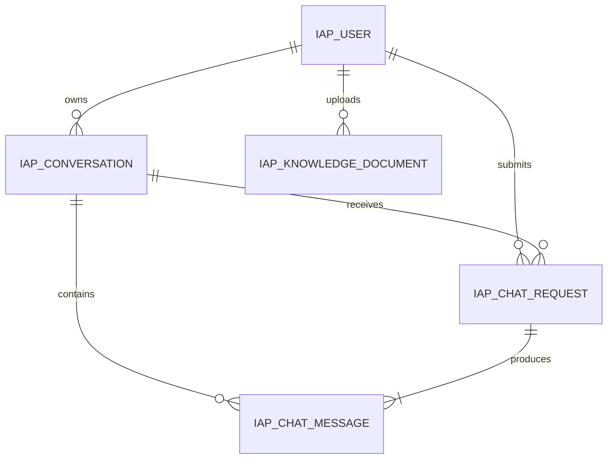
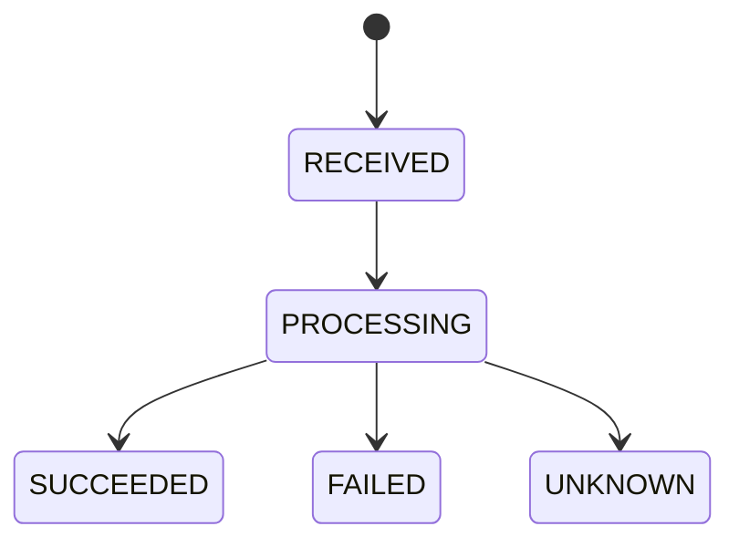
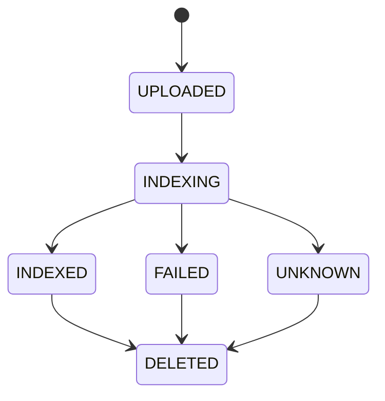

# Insurance AI Platform 数据库设计

> 文档版本：v1.0
> 状态：Phase 2 v1.0 已冻结；自 2026-08-01 起生效
> 数据库：MySQL 8，字符集 `utf8mb4`
> 架构依据：[ARCHITECTURE.md](./ARCHITECTURE.md)
> 关联文档：[API.md](./API.md) / [REDIS.md](./REDIS.md) / [DECISIONS.md](./DECISIONS.md)
> 范围：冻结逻辑表、字段、关系、状态、索引和事务边界；本阶段不创建 SQL、Entity 或 Mapper

## 1. 事实来源与所有权

- MySQL 由 Java Backend 管理，保存用户、会话、聊天请求、完整消息和文档元数据。
- MySQL 是完整聊天记录和索引业务状态的唯一长期事实来源。
- Redis 只保存可过期缓存、限流和幂等加速数据；缓存丢失可从 MySQL 回源。
- Python 不访问本数据库；Java 通过内部 HTTP 把有限历史和文档内容传给 Python。
- FAISS 由 Python 管理，只保存可重建的派生向量索引，不进入 MySQL。

当前仓库没有这些表、Entity 或 Mapper；本文件描述后续目标设计。

## 2. 设计约定

- 表名、字段名使用 `snake_case`，表名前缀统一为 `iap_`。
- 内部主键使用 `BIGINT UNSIGNED`；对外业务 ID 使用 Java 生成的 UUID，逻辑类型 `CHAR(36)`。
- 时间使用 `DATETIME(3)`，由应用按 UTC 写入；API 再序列化为 ISO-8601。
- 状态字段使用 `VARCHAR` + Java 枚举，不使用 MySQL `ENUM`，便于演进和测试。
- 逻辑删除字段为 `deleted_at`；为空表示有效。删除语义由 Service 决定，不使用级联物理删除。
- 密码只保存强哈希摘要，绝不保存明文或可逆密码。
- 消息正文使用 `TEXT`，Java 在写入前执行 4000 字符业务校验。
- 本阶段不编写建表 SQL；Phase 7/9/10 按本逻辑设计分模块落地 migration。

## 3. 关系模型

为什么单独保留 `iap_chat_request`：一次同步聊天可能处于处理中、明确失败或读取超时后的结果未知状态。该记录负责幂等和执行状态；`iap_chat_message` 只负责保存用户与助手消息，避免让消息行同时扮演请求状态机。

## 4. 逻辑表设计

下列类型是 Phase 2 的逻辑类型；最终 DDL 需遵守长度、非空、唯一和索引约束，不得自行改变语义。

### 4.1 `iap_user`

| 字段 | 类型 | 约束 | 说明 |
|---|---|---|---|
| `id` | BIGINT UNSIGNED | PK | 内部主键 |
| `user_id` | CHAR(36) | NOT NULL, UNIQUE | 对外 UUID |
| `username` | VARCHAR(64) | NOT NULL, UNIQUE | trim 后账号名；大小写规范在 Phase 9 固化 |
| `password_hash` | VARCHAR(100) | NOT NULL | 密码哈希摘要 |
| `status` | VARCHAR(16) | NOT NULL | `ACTIVE` / `DISABLED` |
| `created_at` | DATETIME(3) | NOT NULL | UTC |
| `updated_at` | DATETIME(3) | NOT NULL | UTC |
| `deleted_at` | DATETIME(3) | NULL | 逻辑删除时间 |

索引：

- `uk_user_user_id(user_id)`；
- `uk_user_username(username)`。

### 4.2 `iap_conversation`

| 字段 | 类型 | 约束 | 说明 |
|---|---|---|---|
| `id` | BIGINT UNSIGNED | PK | 内部主键 |
| `conversation_id` | CHAR(36) | NOT NULL, UNIQUE | 对外 UUID，也作为 Python `sessionId` |
| `user_id` | BIGINT UNSIGNED | NOT NULL, FK → `iap_user.id` | 业务归属 |
| `title` | VARCHAR(100) | NULL | 用户标题；不自动伪造 AI 标题 |
| `status` | VARCHAR(16) | NOT NULL | `ACTIVE` / `DELETED` |
| `created_at` | DATETIME(3) | NOT NULL | UTC |
| `updated_at` | DATETIME(3) | NOT NULL | UTC |
| `deleted_at` | DATETIME(3) | NULL | 逻辑删除时间 |

索引：

- `uk_conversation_id(conversation_id)`；
- `idx_conversation_user_updated(user_id, updated_at DESC)`，服务于用户会话列表。

### 4.3 `iap_chat_request`

| 字段 | 类型 | 约束 | 说明 |
|---|---|---|---|
| `id` | BIGINT UNSIGNED | PK | 内部主键 |
| `request_id` | CHAR(36) | NOT NULL, UNIQUE | Java 生成，传给 Python |
| `user_id` | BIGINT UNSIGNED | NOT NULL, FK → `iap_user.id` | 支撑用户级幂等唯一性 |
| `conversation_id` | BIGINT UNSIGNED | NOT NULL, FK → `iap_conversation.id` | 所属会话 |
| `idempotency_key` | CHAR(36) | NOT NULL | 公共 Header 的 UUID |
| `request_hash` | CHAR(64) | NOT NULL | conversationId + 规范化 message 的 SHA-256 |
| `status` | VARCHAR(16) | NOT NULL | 请求状态机 |
| `error_code` | VARCHAR(64) | NULL | 稳定错误码，不保存异常类名 |
| `error_message` | VARCHAR(500) | NULL | 脱敏摘要，不保存堆栈 |
| `started_at` | DATETIME(3) | NULL | 进入 PROCESSING 的时间 |
| `completed_at` | DATETIME(3) | NULL | 进入终态的时间 |
| `created_at` | DATETIME(3) | NOT NULL | UTC |
| `updated_at` | DATETIME(3) | NOT NULL | UTC |

索引和约束：

- `uk_chat_request_id(request_id)`；
- `uk_chat_request_user_idem(user_id, idempotency_key)`：同一用户不重复执行；
- `idx_chat_request_conversation_created(conversation_id, created_at)`；
- 命中同一幂等键后必须比较 `request_hash`；不同则返回冲突。

### 4.4 `iap_chat_message`

| 字段 | 类型 | 约束 | 说明 |
|---|---|---|---|
| `id` | BIGINT UNSIGNED | PK | 内部主键 |
| `message_id` | CHAR(36) | NOT NULL, UNIQUE | 对外 UUID |
| `conversation_id` | BIGINT UNSIGNED | NOT NULL, FK → `iap_conversation.id` | 所属会话 |
| `chat_request_id` | BIGINT UNSIGNED | NOT NULL, FK → `iap_chat_request.id` | 产生本消息的请求 |
| `role` | VARCHAR(16) | NOT NULL | `USER` / `ASSISTANT` |
| `content` | TEXT | NOT NULL | 业务正文，最大 4000 字符 |
| `sequence_no` | BIGINT UNSIGNED | NOT NULL | 会话内稳定递增顺序 |
| `created_at` | DATETIME(3) | NOT NULL | UTC |

索引和约束：

- `uk_chat_message_id(message_id)`；
- `uk_chat_message_request_role(chat_request_id, role)`：一次请求最多一条用户消息和一条助手消息；
- `uk_chat_message_conversation_seq(conversation_id, sequence_no)`；
- `idx_chat_message_conversation_created(conversation_id, created_at)`。

仅当 Python 明确成功时写入助手消息。失败或结果未知时不写占位回答，状态保存在 `iap_chat_request`。

### 4.5 `iap_knowledge_document`

| 字段 | 类型 | 约束 | 说明 |
|---|---|---|---|
| `id` | BIGINT UNSIGNED | PK | 内部主键 |
| `document_id` | CHAR(36) | NOT NULL, UNIQUE | 对外 UUID，传给 Python |
| `user_id` | BIGINT UNSIGNED | NOT NULL, FK → `iap_user.id` | 上传者/归属 |
| `index_request_id` | CHAR(36) | NOT NULL, UNIQUE | 本次首次索引请求 UUID |
| `original_filename` | VARCHAR(255) | NOT NULL | 仅展示，不作为存储路径 |
| `storage_key` | VARCHAR(512) | NOT NULL, UNIQUE | Java 管理的受控文件标识 |
| `content_type` | VARCHAR(64) | NOT NULL | v1 必须为 PDF 对应 MIME |
| `size_bytes` | BIGINT UNSIGNED | NOT NULL | 最大 20 MiB |
| `sha256` | CHAR(64) | NOT NULL | 文件完整性校验 |
| `index_status` | VARCHAR(16) | NOT NULL | 文档索引状态机 |
| `error_code` | VARCHAR(64) | NULL | 稳定错误码 |
| `error_message` | VARCHAR(500) | NULL | 脱敏摘要 |
| `created_at` | DATETIME(3) | NOT NULL | UTC |
| `updated_at` | DATETIME(3) | NOT NULL | UTC |
| `deleted_at` | DATETIME(3) | NULL | 逻辑删除时间 |

索引：

- `uk_document_id(document_id)`；
- `uk_document_index_request(index_request_id)`；
- `uk_document_storage_key(storage_key)`；
- `idx_document_user_created(user_id, created_at DESC)`；
- `idx_document_status_updated(index_status, updated_at)`。

不对 `(user_id, sha256)` 建唯一约束：相同内容是否允许作为不同业务文档上传属于 Phase 10 产品规则，不应由当前数据库误判。

## 5. 状态机

### 5.1 聊天请求状态

| 状态 | 含义 | 是否终态 | 是否可自动重试原请求 |
|---|---|---:|---:|
| `RECEIVED` | 幂等记录和用户消息已持久化 | 否 | 否，由 Service 继续处理 |
| `PROCESSING` | 正在调用 Python | 否 | 否 |
| `SUCCEEDED` | 助手消息已持久化 | 是 | 不需要；重复请求返回原结果 |
| `FAILED` | 得到明确失败结果 | 是 | 否；用户显式发新请求时使用新 Key |
| `UNKNOWN` | 读取超时/连接中断，远端可能已执行 | 是 | 否；禁止自动二次调用 |

连接在请求发送前明确失败：Service 可在同一 `PROCESSING` 状态、同一 requestId 和总预算内执行最多一次连接级重试；最终仍失败则进入 `FAILED`。熔断打开属于明确未调用 Python，进入 `FAILED`。

### 5.2 文档索引状态

| 状态 | 含义 |
|---|---|
| `UPLOADED` | 原文件和元数据已保存，尚未调用 Python |
| `INDEXING` | 正在同步构建索引 |
| `INDEXED` | Python 明确返回索引成功 |
| `FAILED` | Python 明确返回失败或调用前失败 |
| `UNKNOWN` | 读取超时，Python 处理结果未知 |
| `DELETED` | 业务逻辑删除；FAISS 清理需 Phase 10 明确完成 |

HTTP 202/已接收不能映射为 `INDEXED`。v1 是同步调用，不使用异步 `task_id`。

## 6. 事务边界

### 6.1 正常聊天

事务 A（短事务）：

1. 锁定或校验会话归属与 ACTIVE 状态；
2. 按 `(user_id, idempotency_key)` 查询/创建 chat request；
3. 创建唯一用户消息和 sequenceNo；
4. 把 request 状态更新为 `PROCESSING`；
5. 提交。

事务外：读取有限历史并调用 Python。不得持有数据库事务等待 60 秒远程调用。

事务 B（短事务）：

- 成功：写入唯一助手消息，把 request 更新为 `SUCCEEDED`；
- 明确失败：更新为 `FAILED` 并写稳定错误摘要；
- 读取超时：更新为 `UNKNOWN`，不写助手消息。

事务提交后失效 Redis 近期消息缓存。缓存失败不回滚 MySQL 业务事实。

### 6.2 重复聊天

- 唯一约束负责最终防重，不能只依赖“先查再写”。
- 同 Key + 同 hash：根据已有状态返回处理中、既有成功结果或既有失败/未知状态；不新建消息、不调用 Python。
- 同 Key + 不同 hash：返回 `CHAT_IDEMPOTENCY_CONFLICT`。

### 6.3 文档上传与索引

1. Java 先以受控名称保存 PDF；
2. 短事务创建 `UPLOADED` 元数据；若事务失败，删除刚创建且尚未对外发布的文件；
3. 短事务更新为 `INDEXING`；
4. 事务外通过 `KnowledgeClient` 流式传输文件；
5. Python 明确成功后短事务更新 `INDEXED`；明确失败更新 `FAILED`；读取超时更新 `UNKNOWN`。

不使用分布式事务。文件补偿、索引原子替换和删除一致性在 Phase 10 实现并测试。

## 7. 查询与分页

- 会话列表按 `updated_at DESC, id DESC`，使用 page/size v1 契约；数据量增长后的游标分页属于演进项。
- 消息按 `sequence_no ASC` 返回；sequenceNo 在 Java Service/Mapper 的事务内安全生成。
- 所有会话、消息和文档查询必须带当前用户归属条件，不能先按公开 ID 查询再忽略归属。
- 默认查询过滤 `deleted_at IS NULL`。
- Mapper 只负责 SQL，归属、状态转换和事务编排由 Service 负责。

## 8. 数据保留与安全

- v1 不自动清理聊天记录和 chat request；它们与会话保留周期一致。
- 逻辑删除不等于立即物理擦除；具体数据保留/隐私策略在部署前另行评审。
- `error_message` 必须脱敏且最多 500 字符，不写异常堆栈。
- 不保存 JWT、DeepSeek API Key、用户密码明文、FAISS 向量或 LangChain 消息对象。
- 日志与数据库中默认不复制完整 PDF 内容。

## 9. 所有权总表

| 数据 | 权威所有者 | 派生/缓存 | 恢复规则 |
|---|---|---|---|
| 用户、会话、chat request、完整消息 | Java/MySQL | Redis 近期缓存 | Redis 从 MySQL 重建 |
| PDF 原文件 | Java 管理的文件存储 | Python 仅接收受控内容 | 由 Java 文件生命周期管理 |
| 文档元数据与索引业务状态 | Java/MySQL | 可查询缓存暂不引入 | Python 结果经 Service 更新 |
| FAISS 索引与向量 | Python AI Service | Python 运行时加载 | 从受控原文件重新构建 |
| Python requestId 10 分钟防重结果 | Python 进程内短期登记表 | 无 | 重启后以 Java MySQL 为准 |

## 10. 冻结结论

数据库设计采用 5 张有真实职责的逻辑表，没有引入领域事件、Outbox、分布式事务或冗余向量表。后续 DDL 可补充 MySQL 语法和物理参数，但不得改变唯一事实来源、幂等唯一性、状态机和事务外远程调用原则；变化必须先更新本文件并 Review。
