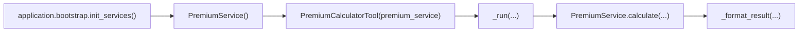
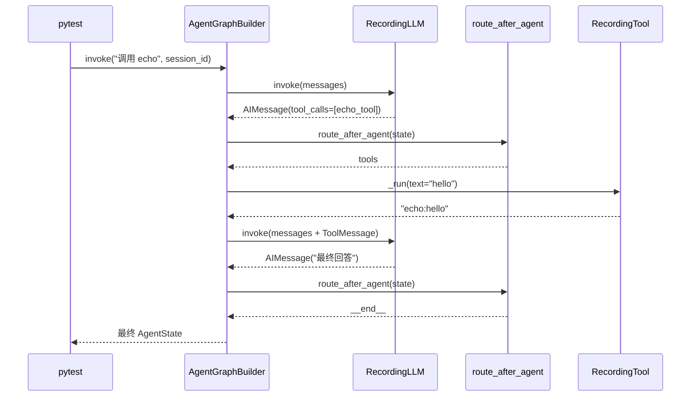
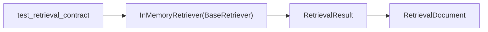

# Phase 0.5 调用图

## 1. 生产代码中的保费 DI



关键不变量：bootstrap 创建的 `PremiumService` 与 Tool 保存的 `_service` 是同一对象，Tool 内部不再创建第二个 Service。

## 2. 最小 Graph 测试



真实部分是 LangGraph、Graph 节点、Router 和消息合并；Mock 只替换 DeepSeek 和 Tool 外部协作。

## 3. Retriever 契约测试



该测试只验证 Repository 抽象和归一化数据结构，不实例化 LangChain/LlamaIndex、Embedding 或 FAISS。

## 4. 消息安全截断

```text
HumanMessage
  → AIMessage(tool_calls=[call-1])
  → ToolMessage(tool_call_id=call-1)
  → AIMessage(final)
  → safe_truncate_messages
  → 保留完整 tool call / tool response 配对
```

孤立的 `ToolMessage` 会被过滤，避免发送给模型时违反 Tool Calling 消息协议。
