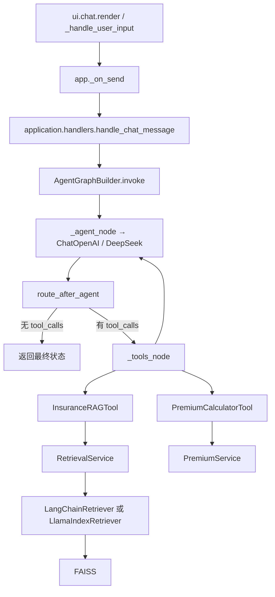
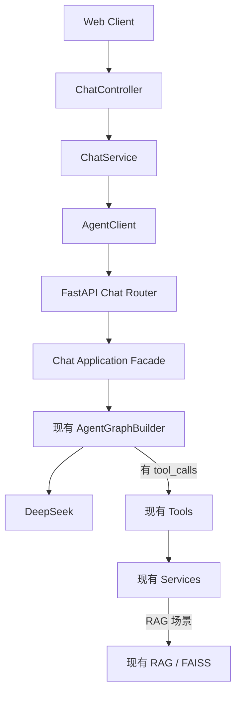

# Phase 1 Call Graph：当前实现与目标设计

> 图例：**已实现**表示可在当前 Python 源码定位；**目标，尚未实现**表示 Phase 1 设计。

## A. 当前真实调用链（已实现）

### A.1 启动前置链

```text
streamlit run app.py
→ app.py
→ application.bootstrap.init_services(rag_engine)
→ EmbeddingManager
→ Builder + Retriever
→ KnowledgeService / RetrievalService / PremiumService
→ InsuranceRAGTool / PremiumCalculatorTool
→ AgentGraphBuilder
```

bootstrap 是启动/Streamlit rerun 时的对象装配，不是每条用户消息的固定节点。

### A.2 聊天运行链



Graph 负责 Agent/Router 编排；Tools 是条件分支；只有 RAG Tool 才进入 Retriever/FAISS。

| 节点 | 输入 | 输出 | 职责 | 下一对象 | 状态 |
|---|---|---|---|---|---|
| `ui.chat._handle_user_input` | 用户 prompt | 回调结果 | Streamlit 渲染与会话 UI | `app._on_send` | 已实现 |
| `app._on_send` | prompt | handler 字典 | 绑定当前 session ID | `handle_chat_message` | 已实现 |
| `handle_chat_message` | prompt、graph、session ID | 解析后的回答 | 调 Graph、统计耗时、解析结果 | `AgentGraphBuilder.invoke` | 已实现 |
| `AgentGraphBuilder.invoke` | message、session ID | AgentState | 创建初始状态并同步执行图 | `_agent_node` | 已实现 |
| `_agent_node` | messages | AIMessage/monitor | 调 DeepSeek，可能产生 tool_calls | `route_after_agent` | 已实现 |
| `route_after_agent` | 最后一条消息 | `tools` 或 `__end__` | 条件路由 | `_tools_node` 或结束 | 已实现 |
| `_tools_node` | tool_calls | ToolMessage/result | 查找并执行 Tool，再回 Agent | Tool `_run` | 已实现 |
| `InsuranceRAGTool._run` | query | LLM 可读文本 | RAG Tool 协议适配 | `RetrievalService` | 已实现 |
| `RetrievalService.search` | query/top_k | RetrievalResult | 检索编排和结构归一 | BaseRetriever 实现 | 已实现 |
| Retriever/FAISS | query | 文档及分数 | 向量检索 | Graph ToolMessage | 已实现 |
| `PremiumCalculatorTool` | 保费参数 | 格式化文本 | 委托保费计算 | `PremiumService` | 已实现 |

## B. Phase 1 目标聊天链（目标设计，尚未实现）



| 节点 | 输入 | 输出 | 职责 | 下一对象 | 状态 |
|---|---|---|---|---|---|
| Web Client | 用户操作 | HTTP 请求 | 展示和输入 | `ChatController` | 目标，尚未实现 |
| `ChatController` | Chat DTO、JWT 上下文 | 统一响应 | HTTP 校验和返回 | `ChatService` | 目标，尚未实现 |
| `ChatService` | 用户、session、message | Chat VO | 归属校验、消息状态、业务编排 | `AgentClient`/Mapper | 目标，尚未实现 |
| `AgentClient` | requestId、sessionId、message、history | Python DTO | 内部 HTTP、超时、错误映射、熔断 | FastAPI Router | 目标，尚未实现 |
| FastAPI Chat Router | HTTP/Pydantic DTO | HTTP 响应 | HTTP、TraceId、调用 Facade | Chat Facade | 目标，尚未实现 |
| Chat Facade | 内部 DTO | 结构化 AI 结果 | 协议转换、调用现有 Graph | `AgentGraphBuilder` | 目标，尚未实现 |
| `AgentGraphBuilder` 以后 | message/有限历史 | AgentState | 保留当前 Agent/Router/Tool 语义 | DeepSeek/Tools | 核心已实现，HTTP 适配未实现 |

MySQL 保存完整聊天记录；Redis 只保存近期缓存和短期数据；当前 `InMemorySaver` 不得成为
生产长期事实源。

## C. Phase 1 目标知识库上传链（目标设计，尚未实现）

```text
Web Client
→ DocumentController
→ DocumentService
   ├─ Java File Storage：PDF 原文件
   ├─ DocumentMapper → MySQL：元数据和 PENDING/PROCESSING
   └─ KnowledgeClient
      → FastAPI Knowledge Router
      → Knowledge Application Facade
      → 现有 KnowledgeService
      → BaseIndexBuilder
      → 文本加载/切分
      → BGE Embedding
      → FAISS
      → 结果返回 DocumentService
      → MySQL 更新 SUCCESS/FAILED
```

| 节点 | 输入 | 输出 | 职责 | 下一对象 | 状态 |
|---|---|---|---|---|---|
| `DocumentController` | PDF + 请求参数 | 统一响应 | HTTP、校验、返回 | `DocumentService` | 目标，尚未实现 |
| `DocumentService` | 用户、文件 | 文档状态 VO | 文件/元数据/索引业务编排 | Storage、Mapper、Client | 目标，尚未实现 |
| Java File Storage | 受控 PDF | 文件标识 | 原文件权威存储 | `KnowledgeClient` | 目标，尚未实现 |
| MySQL 文档元数据 | Document Entity | 持久化状态 | 上传者、文件标识、索引业务状态 | `DocumentService` | 目标，尚未实现 |
| `KnowledgeClient` | 文件内容或受控引用 | Python 结果 | 内部 HTTP 边界 | Knowledge Router | 目标，尚未实现 |
| Knowledge Router/Facade | Pydantic DTO | 索引结果 | HTTP 与协议转换 | `KnowledgeService` | 目标，尚未实现 |
| `KnowledgeService` | 构建命令 | 构建结果 | 索引生命周期门面 | `BaseIndexBuilder` | 已实现，HTTP 包装未实现 |
| Split/Embedding/FAISS | 文档内容 | 派生索引 | Python AI 索引处理 | Python 持久化目录 | 已实现 |
