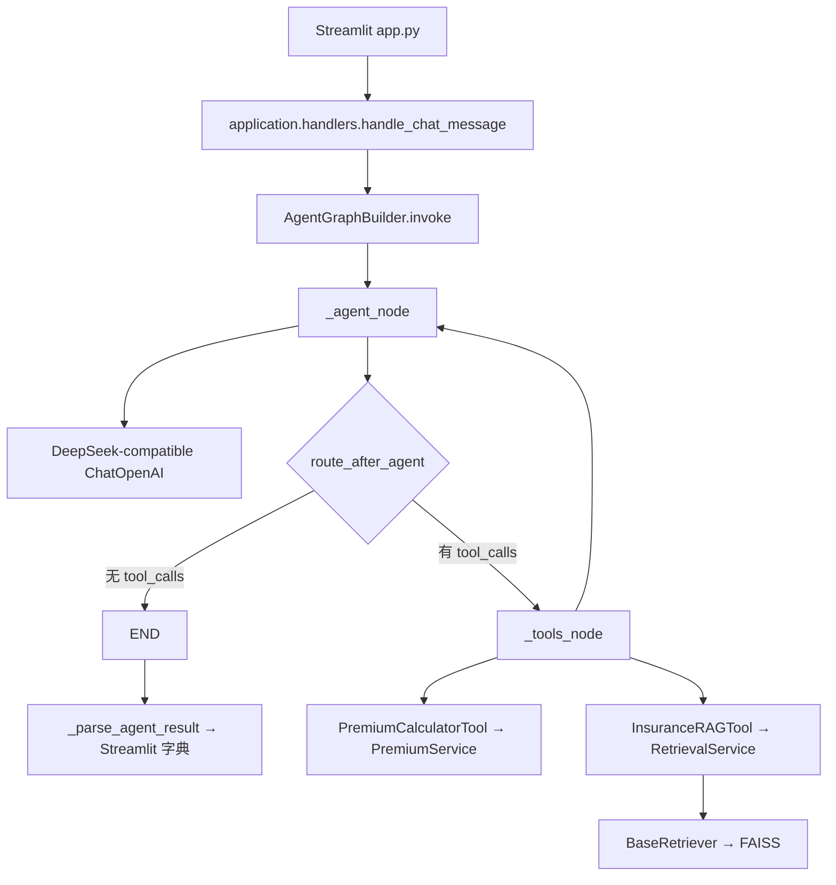
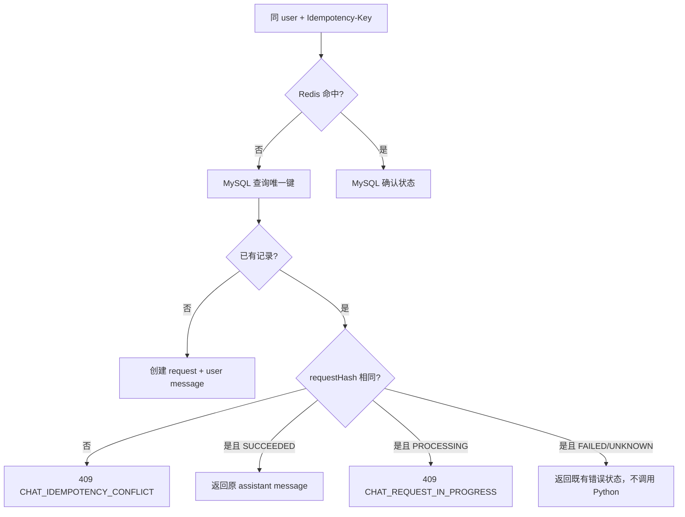
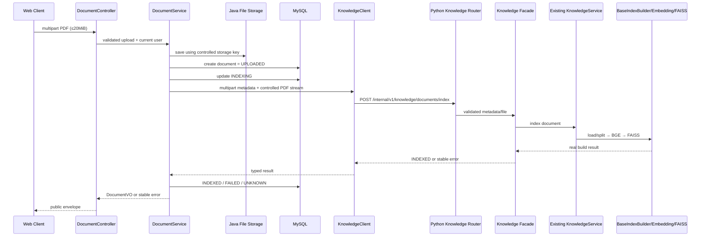

# Phase 2 CallGraph：契约如何流过系统

## 状态说明

- “当前真实”节点来自现有 Python 源码。
- “目标、未实现”节点来自冻结架构和 Phase 2 契约。
- Phase 2 没有创建 Java/FastAPI 代码，以下目标图用于后续实现验收。

## A. 当前真实聊天调用链



关键事实：

| 节点 | 输入 | 输出 | 职责 | 当前实现 |
|---|---|---|---|---:|
| `handle_chat_message` | prompt、graph_builder、session_id | Streamlit 结构化字典 | 调 Graph 并解析结果 | 是 |
| `AgentGraphBuilder.invoke` | 当前 user_message、session_id | AgentState 结果 | 同步运行已编译 Graph | 是 |
| `_agent_node` | state messages | AIMessage/monitor | 裁剪上下文并调用 LLM | 是 |
| `route_after_agent` | AgentState | tools 或 end | 条件路由 | 是 |
| `_tools_node` | AI tool_calls | ToolMessage/监控 | 按名称执行已注入 Tool | 是 |
| `RetrievalService` | query/topK | RetrievalResult | 编排检索和格式化 | 是 |
| `_parse_agent_result` | Graph 结果 | final_answer 等 | Streamlit 展示适配 | 是 |

它不是固定的 Graph→Tools→Services→RAG 线性链：直接回答不进入 Tool；保费 Tool 不进入 RAG。

## B. 目标正常聊天链路（尚未实现）

```mermaid
sequenceDiagram
    participant W as Web Client
    participant C as ChatController
    participant S as ChatService
    participant DB as MySQL
    participant R as Redis
    participant AC as AgentClient
    participant PR as FastAPI Router
    participant F as Chat Facade
    participant G as Existing LangGraph

    W->>C: POST /api/v1/chat/messages + Idempotency-Key
    C->>S: validated DTO + authenticated user
    S->>R: rate limit (20/min)
    S->>DB: TX A: create request + user message → PROCESSING
    S->>R: read recent messages
    alt cache miss
        S->>DB: query latest 10 messages excluding current requestId
        S->>R: fill 30min cache
    end
    S->>AC: requestId/sessionId/message/history
    AC->>PR: POST /internal/v1/agent/chat + X-Trace-Id
    PR->>F: validated Python Schema
    F->>G: convert history/current message and invoke
    G-->>F: answer + real sources
    F-->>AC: internal success envelope
    AC-->>S: typed result
    S->>DB: TX B: assistant message + SUCCEEDED
    S->>R: delete recent cache; update idempotency summary
    S-->>C: ChatResponseVO
    C-->>W: public envelope
```

### 节点契约

| 节点 | 输入 | 输出 | 职责 | 已实现 |
|---|---|---|---|---:|
| `ChatController` | HTTP/DTO | 公共 Envelope | 接收、校验、调用 Service | 否 |
| `ChatService` | 当前用户、DTO、幂等 Key | ChatResponseVO | 归属、事务、状态、历史和 Client 编排 | 否 |
| `ChatMessageMapper` 等 | SQL 参数 | Entity/行数 | MySQL 数据访问 | 否 |
| `AgentClient` | 内部请求模型 | typed AI result | HTTP、超时、错误映射、熔断 | 否 |
| FastAPI Router | 内部 HTTP | 内部 Envelope | HTTP/Schema/trace，不写业务逻辑 | 否 |
| Chat Facade | Python Schema | 稳定 Python response | 历史转换、requestId 短期防重、调用 Graph | 否 |
| Existing Graph | LangChain messages/state | Agent result | Agent/Router/Tool 编排 | 是 |

## C. 读取超时链路（目标，尚未实现）

```text
AgentClient 已发送 requestId R
→ Python 可能仍在执行 DeepSeek/Tool
→ Java 等待 60 秒后读取超时
→ 不发送第二次 POST
→ ChatService 事务更新 chat_request(R) = UNKNOWN
→ 不写 assistant message
→ Redis 幂等摘要 = UNKNOWN
→ Web 收到 HTTP 504 / AI_SERVICE_TIMEOUT
```

关键点：Java 停止等待不等于 Python 停止。相同 Idempotency-Key 再到达时查询原 UNKNOWN，不重复调用 Tool。

## D. 幂等重复链路（目标，尚未实现）



## E. 知识库上传与索引（目标，尚未实现）



### 所有权

| 数据 | 所有者 |
|---|---|
| PDF 原文件 | Java 管理的文件存储 |
| 文档 ID、上传者、元数据、索引业务状态 | Java/MySQL |
| 解析、切分、Embedding 过程 | Python |
| FAISS 文件和运行时 Vector Store | Python |

## F. bootstrap 不在请求链中重复执行

目标生命周期：FastAPI lifespan 启动时调用一次 `application/bootstrap.py`，装配 Embedding、Vector Store、Service、Tool 和 Graph；每个请求只复用这些长生命周期对象。bootstrap 不解析 HTTP、不决定用户权限、不保存 Java 业务状态。
